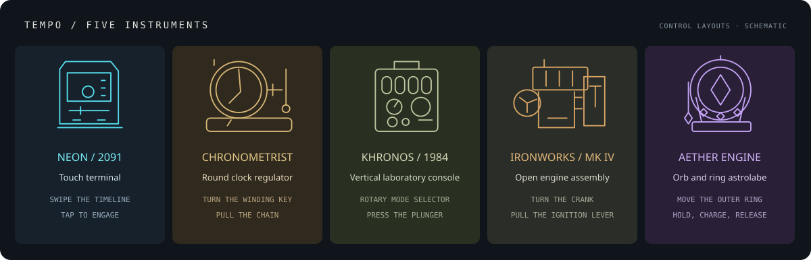

# Tempo

A tactile Pomodoro timer built as five separate Three.js instruments. Each has its own enclosure, control positions, mechanisms and way of starting a session. Switch between them without losing the countdown.



_The image above illustrates the control layouts; it is not a browser capture._

| Instrument            | Physical design                                                                                                       | Set the time                                    | Start / pause                                                |
| --------------------- | --------------------------------------------------------------------------------------------------------------------- | ----------------------------------------------- | ------------------------------------------------------------ |
| **Neon / 2091**       | Chamfered touch terminal, recessed luminous display, vertical touch tabs, linear timeline                             | Swipe the timeline horizontally                 | Tap the illuminated pad                                      |
| **Chronometrist**     | Round wooden clock regulator, brass rim, exposed gears, separate plinth and winding key                               | Turn the winding key beside the clock           | Pull the attached chain down, then release                   |
| **Khronos / 1984**    | Upright laboratory console, four gas-discharge tubes, rotary mode selector, bakelite duration knob and round plungers | Turn the detented knob                          | Press the red plunger                                        |
| **Ironworks / MK IV** | Open engine assembled from separate pods, exposed pipes, side crank and hinged numeral cards                          | Turn the side crank                             | Pull the ignition handle down through its gate, then release |
| **Aether Engine**     | Orb in a claw-supported astrolabe, rotating engraved outer ring, crystal seals and hanging pendulum                   | Drag the right edge of the outer ring up / down | Hold the sphere for 0.7 seconds, then release                |

Mechanical switches and their legends sit on mounting plates inside the enclosures. The clock chain feeds from its bracket as it is pulled; the engine handle follows the pointer; the magical seal shows charging progress. Ordinary printing stays on physical surfaces. The arcane readout and plasma are intentionally luminous.

## Run

```sh
npm ci
npm run dev
```

Open [localhost:3000](http://localhost:3000). The local Codex preview uses [localhost:3071](http://localhost:3071).

For a production preview:

```sh
npm run build
npm start -- --hostname 127.0.0.1 --port 3071
```

## Controls

- **Mode:** Focus / Short rest / Long rest. The clock and Soviet console use a three-position rotary selector; Ironworks uses a sliding gear selector; Neon uses touch tabs; the astrolabe uses three mounted crystal seals. Reset an active session before changing mode or duration.
- **Rhythm:** defaults to 25 / 5 / 15 minutes. Every fourth completed focus session is followed by a long rest. Auto starts the next session immediately; otherwise it waits.
- **Keyboard:** Space starts / pauses, R resets, M toggles sound. Focus the duration or mode selector and use arrow keys. Duration also supports Home / End. Native keyboard activation bypasses the pull / hold gesture for accessibility. Shortcuts leave text inputs and dialogs alone.
- **Fidgets:** the clock has a free gear, the Soviet console a spring, Ironworks a piston, and the astrolabe a pendulum. Drag their small auxiliary mechanisms, or press the auxiliary cap. These do not change the timer.
- **Inspection:** drag the housing to look around; double-click the housing to restore the view. Projected HTML input targets follow the physical controls as the camera moves.
- **Settings:** type custom durations and adjust sound volume. Sound and Auto switches use touch strips, mechanical levers, rockers or crystal seals according to the instrument.

## Rendering and state

The scene uses physical materials with correlated color, roughness and bump maps, local HDR lighting, area lights, contact shadows, ambient occlusion and alpha-preserving bloom. Scanlines, plasma, steam and particles animate in the scene. The transparent canvas blends with the page; it has no opaque rectangular backdrop. The camera fits each model's actual dimensions. A CSS fallback keeps the timer usable without WebGL.

Real switch recordings provide separate downstroke and return sounds. Web Audio unlocks after a user gesture. Muting silences the controls and alarm.

The timer uses an absolute deadline, preserves fractional pause / resume time, and completes an overdue session once after reload. Mode lengths, intention, countdown, apparatus choice, sound preferences and today's totals are stored locally. Open tabs share timer updates. There is no account or server sync; blocked storage does not stop the timer.

Reduced motion removes spring settling, camera parallax, fidget inertia and decorative animation. The Soviet instrument renders on demand. Animated instruments stop rendering while hidden; idle animation is capped on phones. Mobile uses a lower pixel ratio and omits screen-space ambient occlusion. Scene geometry, textures, postprocessing targets and audio resources are released on unmount.

## Manual verification

1. Open the preview and select all five devices. Expect a touch terminal, circular clock on a plinth, upright laboratory console, open engine and ring astrolabe. Inspect them from different angles: ordinary labels and switch sockets should remain attached to their supports, with no rectangular canvas background.
2. In each device, choose a mode and change its duration using the mechanism in the table. Start, pause and resume using its own gesture. A short tap on the chain or ignition handle should not start; a sphere released before 0.7 seconds should not start. Pointer cancellation or losing focus should return the mechanism without activation.
3. Start the timer, switch devices and reload. Expect the same deadline and selected apparatus. Reset restores the selected duration. An active session prevents mode / duration changes.
4. Flip Sound and Auto, move the free mechanism and press the auxiliary cap. Expect mechanical feedback and no timer changes from fidgeting. With Sound off, expect silence.
5. Use Tab and arrow keys, open / close Settings, and enable reduced motion. Check a phone-width viewport for reachable controls and no horizontal page overflow.
6. In Ironworks, changing digits should flip into their recess. In a second tab, pause / resume the same timer. Completing focus should increase today's totals exactly once and advance the four-session cycle.

No test files or test suite were added. Production build, TypeScript and lint checks are separate from the user-authorized test step. The current revision has not been visually verified through browser automation; this README does not present the schematic as a live screenshot or GIF.

## Asset credits

Local HDR and wood maps: [Poly Haven — Studio Small 03](https://polyhaven.com/a/studio_small_03), by Greg Zaal, and [Wood Table 001](https://polyhaven.com/a/wood_table_001), by Dimitrios Savva and Rico Cilliers (CC0).

Switch recordings: [Thomas Lai's kbsim](https://github.com/tplai/kbsim), MIT; the license is included in `public/instrument/kbsim-LICENSE.txt`. Source URLs and asset details are recorded in `public/instrument/sources.json` and `public/instrument/ASSETS.md`. Fonts and assets are served locally.
